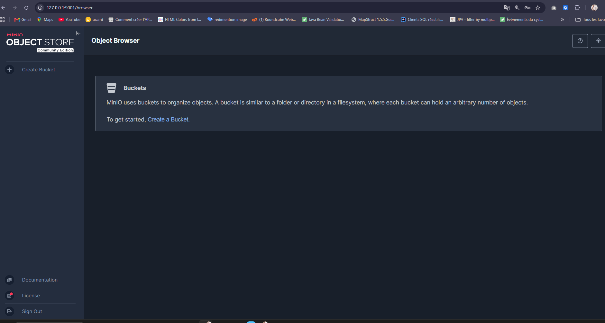
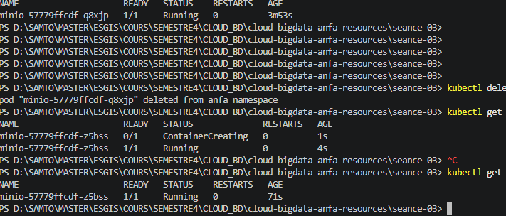
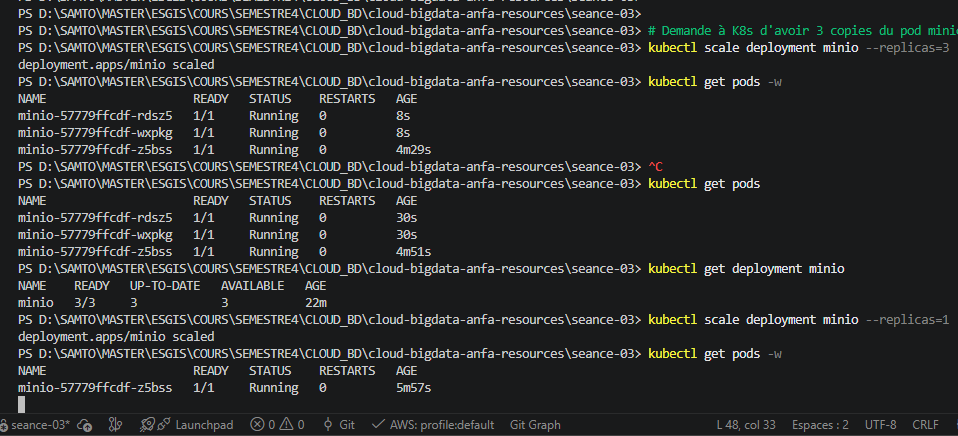

# Rendu Séance 3

**Nom et prénom :** <Votre nom complet></votre> GNAZOUYOUFEI Samto
**Identifiant GitHub :** <votre-username></votre>Samfresh09
**Date de soumission :** 26-06-2026

## Résumé de la séance

Kind installé, cluster Kubernetes créé

namespace anfa configuré, MinIO déployé via 3 manifestes YAML

* [ ] self-healing observé, scaling testé, Ingress Controller activé.

## Étapes principales

1. Installation de Kind et kubectl, création du cluster `anfa`.
2. Création du namespace `anfa` et configuration de kubectl.
3. Déploiement de MinIO via 3 manifestes YAML (PVC, Deployment, Service).
4. Observation du self-healing après suppression manuelle d'un pod.
5. Scaling du Deployment de 1 à 3 replicas, puis retour à 1.
6. Activation de l'Ingress Controller nginx.

## Captures d'écran

### Console MinIO accessible via port-forward

### Self-healing observé

### Scaling à 3 replicas

## Réponses aux exercices d'application

Exercice 1 : QCM conceptuel

1.1 — Réponse : B.
Kubernetes n'embarque pas de moteur de conteneurs ; il orchestre des conteneurs sur un cluster en déléguant leur exécution à un container runtime (containerd, CRI-O, Docker via un shim).

1.2 — Réponse : B (etcd).
etcd est la base clé-valeur distribuée qui stocke l'intégralité de l'état désiré et observé du cluster ; l'API Server est le seul composant à y écrire.

1.3 — Réponse : C (Scheduler).
Le Scheduler observe les pods sans nœud assigné et choisit le nœud le plus adapté selon les ressources, contraintes et règles d'affinité.

1.4 — Réponse : C.
kubectl ne parle jamais directement aux pods ni à etcd : il envoie ses requêtes à l'API Server, point d'entrée unique et authentifié du Control Plane.

1.5 — Réponse : B.
Le Deployment maintient l'état souhaité via son ReplicaSet : si un pod est supprimé, le contrôleur en recrée immédiatement un autre pour revenir au nombre de replicas demandé.

1.6 — Réponse : B (NodePort).
NodePort ouvre un port fixe sur chaque nœud du cluster et permet un accès externe sans dépendre d'un load balancer fourni par le cloud (contrairement à LoadBalancer).

1.7 — Réponse : B.
La commande modifie l'état souhaité du Deployment à 5 replicas ; Kubernetes fait converger le nombre réel de pods vers cette cible (il n'agit pas sur le nombre de machines).

1.8 — Réponse : B.
Un Namespace cloisonne logiquement les ressources d'un même cluster, ce qui permet de séparer équipes, environnements ou applications (et sert de support aux quotas et au RBAC).

1.9 — Réponse : B (des conteneurs Docker).
Kind = Kubernetes IN Docker : chaque « nœud » du cluster est en réalité un conteneur Docker tournant sur l'hôte.

Exercice 2 : Lecture et interprétation d'un manifeste

2.1 — selector.matchLabels et son lien avec template.metadata.labels.
selector.matchLabels indique au Deployment quels pods lui appartiennent : le contrôleur ne gère que les pods portant ces labels. template.metadata.labels définit les labels apposés sur les pods que le Deployment crée. Les deux doivent correspondre : sinon le Deployment créerait des pods qu'il ne reconnaîtrait pas comme siens, et il en recréerait indéfiniment (boucle). Ici app: anfa-api est cohérent des deux côtés.

2.2 — Nombre de pods et auto-réparation.
replicas: 2 → 2 pods sont créés. Si l'un meurt, le ReplicaSet du Deployment détecte l'écart avec l'état souhaité et recrée immédiatement un nouveau pod pour revenir à 2.

2.3 — Pourquoi minio et pas une IP.
minio est un nom DNS de Service résolu par le DNS interne du cluster (CoreDNS). Les IP des pods sont éphémères (elles changent à chaque recréation) ; le Service minio fournit une IP virtuelle (ClusterIP) stable derrière ce nom. La résolution est possible parce qu'il existe un Service nommé minio (dans le même namespace) et que CoreDNS publie une entrée minio.<namespace></namespace>.svc.cluster.local.

2.4 — Conséquence de l'absence de Service.
Sans Service, l'API n'a aucun point d'accès stable ni nom DNS : aucun autre pod ne peut l'atteindre de façon fiable, il n'y a pas de répartition de charge entre les 2 replicas, et les pods ne sont joignables que par leurs IP individuelles et éphémères. L'API est donc déployée mais pratiquement inaccessible « proprement ».

2.5 — Service ClusterIP (port 80 → 8000).

yamlapiVersion: v1
kind: Service
metadata:
  name: anfa-api
  namespace: anfa
spec:
  type: ClusterIP        # accessible uniquement à l'intérieur du cluster
  selector:
    app: anfa-api        # sélectionne les pods du Deployment
  ports:
    - port: 80           # port exposé par le Service
      targetPort: 8000   # port du conteneur
      protocol: TCP

Exercice 3 : Diagnostic

3.1 — Le pod qui ne démarre pas

a. ImagePullBackOff signifie que kubelet n'a pas réussi à télécharger l'image du conteneur depuis le registre, et qu'il attend (back-off) un délai croissant avant de réessayer.

b. Le nom d'image est mal orthographié : minio/miniooo:latest (trois « o ») n'existe pas dans le registre. La cause la plus probable est donc une faute de frappe dans le nom de l'image (image introuvable).

c.

bashkubectl describe pod minio-7d9f8b6c5-x2k9p

La section Events en bas affiche le détail de l'échec (Failed to pull image …, not found).

3.2 — Le PVC qui ne se lie pas

a. Pending pour un PVC signifie qu'il n'a pas encore été lié (Bound) à un PersistentVolume : aucun volume satisfaisant la demande n'a (encore) été fourni.

b. Dans un cluster Kind local, deux explications très probables :

La StorageClass par défaut standard (provisioner local-path) utilise le mode de liaison WaitForFirstConsumer : le PVC reste donc Pending tant qu'aucun pod ne le monte. Or ici le PVC est appliqué seul, sans pod consommateur.
De plus, 500Gi est irréaliste pour le disque local d'un environnement Kind : même si un consommateur existait, la capacité demandée dépasse largement l'espace disponible.

La cause la plus probable, vu qu'aucun pod n'utilise le PVC, est le mode WaitForFirstConsumer ; la taille démesurée est un second problème à corriger.

c.

bashkubectl describe pvc data-pvc      # voir les Events (raison du Pending)
kubectl get storageclass           # vérifier la SC par défaut et son bindingMode

3.3 — Le port-forward qui échoue

a. port-forward redirige du trafic vers un pod en cours d'exécution. Ici le pod ciblé par le Service est Pending (pas encore démarré), donc il n'y a aucun pod Running vers lequel rediriger : l'erreur est logique.

b.

bashkubectl get pods                       # repérer le pod minio en Pending
kubectl describe pod <pod-minio></pod>       # section Events : pourquoi il ne démarre pas

(Souvent : PVC Pending, image non trouvée, ressources insuffisantes…)

c. L'ordre logique à respecter :

Le pod est Running (Deployment/StatefulSet sain, image OK, volumes liés).
Le Service existe et a des endpoints (kubectl get endpoints minio non vide → le selector matche bien le pod).
Seulement ensuite, lancer kubectl port-forward.

Exercice 4 : De Docker Compose à Kubernetes

4.1 — Nombre de manifestes Kubernetes nécessaires.
Le service unique de Compose se traduit par 3 à 4 manifestes :

Deployment (ou StatefulSet) — exécute le conteneur MinIO : image, command (server /data --console-address ":9001"), variables d'environnement, ports 9000/9001.
Service — expose MinIO (ClusterIP pour l'accès interne, et/ou NodePort pour l'accès externe) sur les ports 9000 (API) et 9001 (console).
PersistentVolumeClaim — assure la persistance de /data (remplace le volume nommé minio-data).
Secret (recommandé) — stocke MINIO_ROOT_USER / MINIO_ROOT_PASSWORD au lieu de les mettre en clair dans le manifeste.

4.2 — Volume Docker nommé vs PersistentVolumeClaim.
Un volume Docker nommé est géré directement par le démon Docker sur une seule machine : c'est un répertoire local, simple, lié à cet hôte. En Kubernetes, on sépare la demande de stockage (le PVC : « je veux 10 Gi en ReadWriteOnce ») de l'implémentation réelle (le PV, souvent provisionné dynamiquement via une StorageClass). Ce découplage rend le stockage portable, abstrait et adapté à un cluster multi-nœuds, indépendamment du backend (disque local, EBS, NFS…).

4.3 — Accès direct sur un port de l'hôte.
En Compose, ports: "9001:9001" mappe directement le port sur localhost. Avec Kind, les nœuds sont des conteneurs Docker : un NodePort ouvre le port sur le conteneur-nœud, pas sur ta machine hôte — d'où la nécessité d'un kubectl port-forward. Pour un accès direct façon Compose, il faut configurer Kind avec des extraPortMappings dans le fichier de cluster (qui relient un port du nœud-conteneur à un port de l'hôte), ou installer un load balancer local (MetalLB / cloud-provider-kind) avec un Service LoadBalancer, ou un Ingress avec mapping de port.

4.4 — Deux apports de Kubernetes vs Compose pour MinIO (observés en TP).

Auto-réparation (self-healing) : si le pod MinIO est supprimé/tombe, le contrôleur le recrée automatiquement pour respecter l'état souhaité — la réconciliation continue est native, là où Compose se contente d'une politique de redémarrage.
Mise à l'échelle déclarative et découverte de service : kubectl scale ajuste le nombre de replicas, et le Service + DNS interne fournit un nom stable (minio:9000) avec répartition de charge, sans reconfigurer les clients.

(Autres apports valables : rolling updates sans coupure, persistance structurée PVC/PV, gestion des secrets.)

Exercice 5 : Mini-cas d'architecture

5.1 — Type d'objet Kubernetes par composant.

pipeline-anfa → CronJob. Tâche planifiée et récurrente (chaque nuit à 2 h), qui s'exécute ~15 min puis se termine : c'est exactement le rôle d'un CronJob (qui crée un Job à chaque déclenchement).
anfa-api → Deployment. Service stateless, toujours actif et répliqué, qui doit rester disponible en permanence et supporter la montée en charge : le Deployment gère les replicas, l'auto-réparation et les rolling updates.
anfa-dashboard (Grafana) → Deployment. Application web continue à disponibilité standard ; un Deployment suffit (un StatefulSet + PVC ne serait justifié que pour conserver un état persistant comme des dashboards stockés localement).

5.2 — Paramètres de l'Horizontal Pod Autoscaler pour anfa-api.

minReplicas: 2 (ou 3) — garantit la haute disponibilité et absorbe la charge de base (~5 req/s) même en creux.
maxReplicas: 10 — couvre les pics (~50 req/s, soit ~10× la base) matin et soir.
Métrique cible : utilisation CPU ~60 % (ou métrique custom requests/seconde).

Justification : le profil est très contrasté (creux à 5 req/s, pics à 50 req/s). Un seuil CPU à ~60 % laisse une marge pour scaler avant la saturation lors des pics, puis redescendre aux heures creuses pour économiser les ressources, tandis que minReplicas ≥ 2 assure une redondance permanente (« toujours disponible »).

5.3 — Type de Service pour anfa-api.
LoadBalancer. Le cluster est managé chez un fournisseur cloud et l'API doit être joignable depuis l'extérieur (applications mobiles des conducteurs). Un Service LoadBalancer provisionne automatiquement un load balancer cloud avec une IP publique stable. (En pratique, on combine souvent ClusterIP + Ingress pour mutualiser un seul LB sur plusieurs services HTTP ; mais parmi les trois choix, LoadBalancer est le bon.) ClusterIP serait interne uniquement, NodePort peu robuste et peu pratique en production.

5.4 — Mise à jour sans coupure (mécanisme par défaut).
Par défaut, un Deployment applique une stratégie RollingUpdate. Kubernetes crée progressivement les pods de la nouvelle version tout en gardant les anciens en service, en respectant maxSurge (pods en plus tolérés) et maxUnavailable (pods indisponibles tolérés). Un nouveau pod ne reçoit du trafic via le Service qu'une fois Ready (readiness probe), et les anciens ne sont supprimés qu'après que les nouveaux sont sains. Il y a donc toujours des pods prêts pour servir les requêtes → pas de coupure ; en cas de problème, un kubectl rollout undo permet de revenir en arrière.

5.5 — Squelette de Deployment pour anfa-api.

yamlapiVersion: apps/v1
kind: Deployment
metadata:
  name: anfa-api
  namespace: anfa
  labels:
    app: anfa-api
spec:
  replicas: 3
  selector:
    matchLabels:
      app: anfa-api
  template:
    metadata:
      labels:
        app: anfa-api
    spec:
      containers:
        - name: api
          image: anfa/api:v1
          ports:
            - containerPort: 8000
          env:
            - name: MINIO_ENDPOINT
              value: "http://minio:9000"

## Difficultés rencontrées

Aucune
