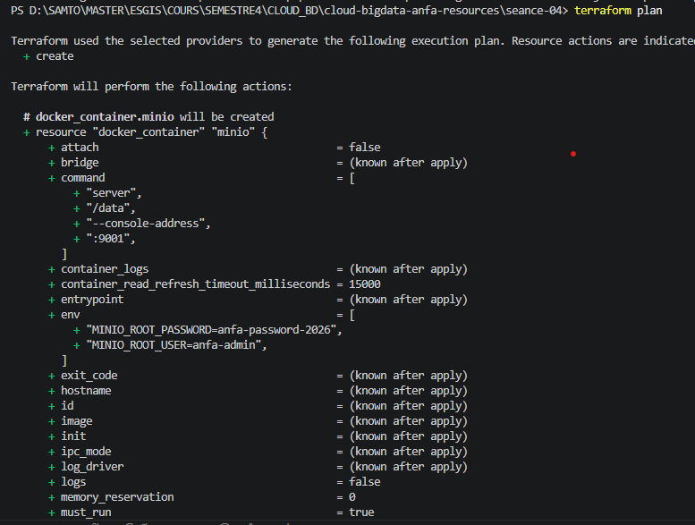
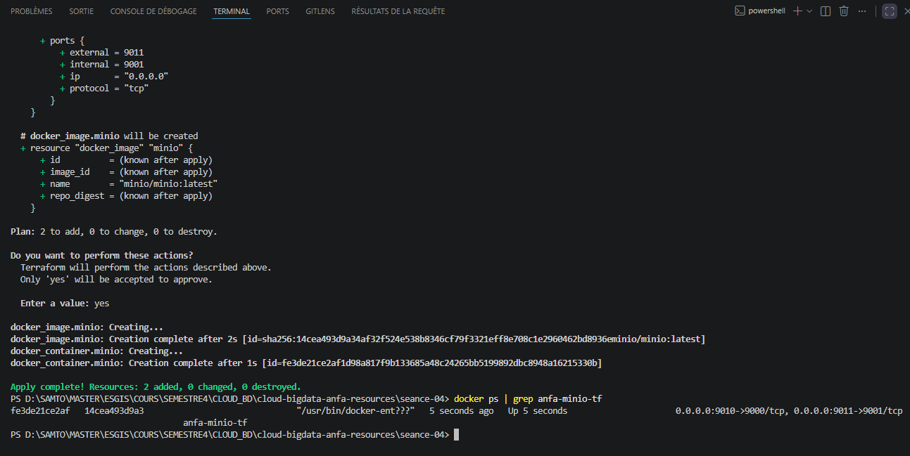
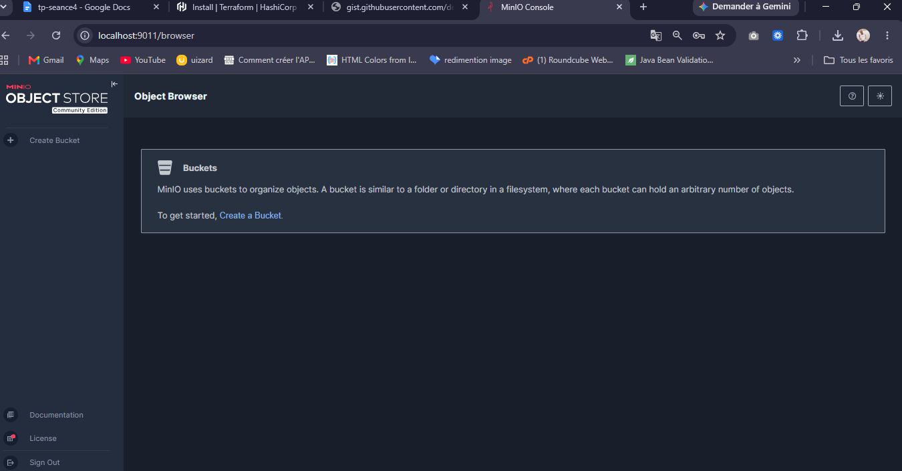
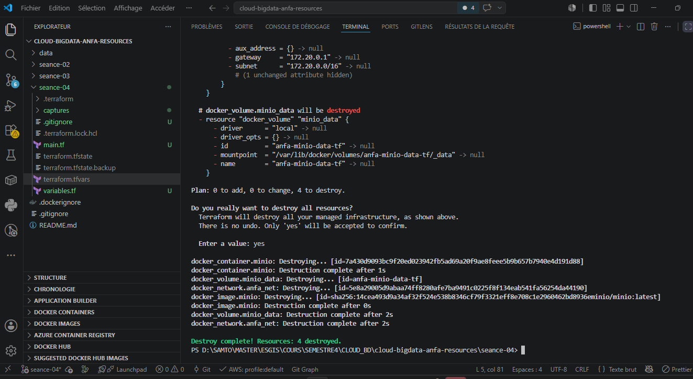

# Rendu — Séance 4

**Nom et prénom :** <Votre nom complet></votre>GNAZOUYOUFEI Samto
**Identifiant GitHub :** <votre-username></votre>Samfresh09
**Date de soumission :** 27/06/2026

## Résumé de la séance

Terraform installé, infrastructure Docker complète décrite en HCL, workflow plan/apply/destroy maîtrisé, code paramétré via variables.

## Étapes principales

1. Installation de Terraform et premier `main.tf` minimal.
2. Maîtrise du workflow `init` → `plan` → `apply` → `destroy`.
3. Compréhension du state Terraform et bonnes pratiques de versioning.
4. Stack complète : réseau, volume, conteneur MinIO.
5. Refactoring en variables et fichier `.tfvars`.

## Captures d'écran

### terraform plan (création initiale)

### terraform apply réussi

### Console MinIO créée par Terraform

### terraform destroy

## Réponses aux exercices d'application

<À compléter d'après les énoncés fournis avec l'assignment.>

## Difficultés rencontrées

Aucune
